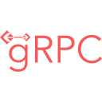

<h1 align="center">Всем привет, я QA Engineer</a> 
</h1>

<h3 align="center">Мои инструменты и технологии:</h3>

  
  
  
  
  
  
  
  
  
  
  
  
  
  
  
  
  
  
  
  
  
  
  
  
  
  

---
(2025г.) Мой проект по разработке сервиса с микросервисной архитектурой, интеграцией с Kafka. и автоматизации тестирования  **[ROCOCO](https://github.com/Timofey050398/rococo)**   
---
<h3 align="center"><b>TELEGRAM</b></h3>

  

